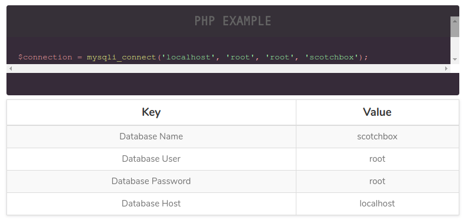
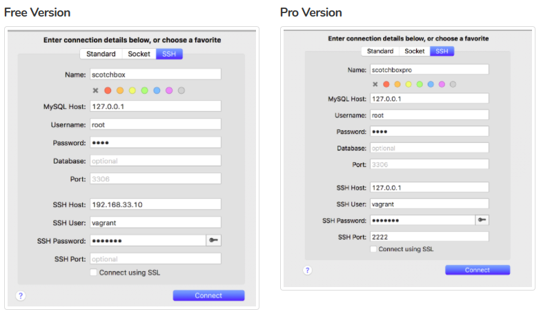
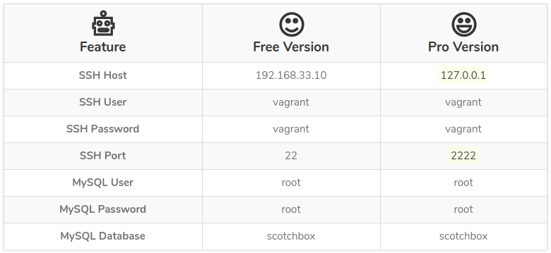

# Getting Started with Vagrant

**Virtualization** refers to the act of creating a virtual (rather than actual) version of something, including virtual computer hardware platforms, storage devices, and computer network resources.

### What is Vagrant?
Vagrant provides the same, easy workflow regardless of your role as a developer, operator, or designer. It leverages a declarative configuration file which describes all your software requirements, packages, operating system configuration, users, and more.

### Why use Vagrant?
Vagrant will isolate dependencies and their configuration within a single disposable, consistent environment, without sacrificing any of the tools you are used to working with (editors, browsers, debuggers, etc.). Once you or someone else creates a single Vagrantfile, you just need to vagrant up and everything is installed and configured for you to work. Other members of your team create their development environments from the same configuration, so whether you are working on Linux, Mac OS X, or Windows, all your team members are running code in the same environment, against the same dependencies, all configured the same way. Say goodbye to "works on my machine" bugs.

---

## Requirements
- [Virtualbox](https://www.virtualbox.org/)
- [Vagrant](https://www.vagrantup.com/)
- [Scotch Box](https://box.scotch.io/)

#### For Linux/Mac
- [Git](https://gist.github.com/derhuerst/1b15ff4652a867391f03)

#### For Windows:
- [Git Bash](https://git-scm.com/)

---

## Installation
> **Note:** Use Git Bash for Windows users

#### Setup SSH Key
```console
$ ssh-keygen -t rsa -C "me@default.com"
```

_You can replace "me@default.com" to any string value but it's recommended to use your email address_

#### Virtualbox
- [https://www.vagrantup.com/downloads.html](https://www.vagrantup.com/downloads.html)

#### Vagrant
- [https://www.virtualbox.org/wiki/Downloads](https://www.virtualbox.org/wiki/Downloads)

_To check version:_

```console
$ vagrant -v
```

#### Git Bash for Windows
- [https://git-scm.com/downloads](https://git-scm.com/downloads)

#### Scotch Box
Scotch Box is a pre-configured Vagrant Box with a full array of features to get you up and running with Vagrant in no time.

- [https://box.scotch.io](https://box.scotch.io)
- [Scotch Box Documentations](https://box.scotch.io/docs/)

#### Add Scotch Box
```console
$ vagrant box add scotch/box
```

#### Clone Scotch Box
```console
$ git clone https://github.com/scotch-io/scotch-box my-project
$ cd my-project
```

#### Setup Hostname
- Open Vagrantfile to any text editor

```plain
...
config.vm.hostname = "scotchbox" // By default
...
```

_Change it to whatever you want_

```plain
...
config.vm.hostname = "my-project"
...
```
---

## Usage

#### Start Environment
```console
$ vagrant up
```

#### Stop Environment
```console
$ vagrant halt
```

#### Enter Inside The Vagrant Box
```console
$ vagrant ssh
```

[For more Commands (CLI)](https://www.vagrantup.com/docs/cli/)

> **Note:** You can check command by entering vagrant --help

## Setup Local DNS

#### For Linux/Mac
```console
$ sudo nano /etc/hosts
```

#### For Windows
- Run Notepad as Administrator
- Go to C:\Windows\System32\drivers\etc
- Open **hosts**

Enter IP Address and Domain name

```console
192.168.33.10   my-project.local
```

> **Note:** By default .local is the extension when using Scotch Box.

## Extra

#### How To Access The Database?
Install GUI Tool

- [HeidiSQL](https://www.heidisql.com/) - (Recommended)
- [MySQL Workbench](https://www.mysql.com/products/workbench/)
- [DataGrip](https://www.jetbrains.com/datagrip/)
- [Navicat For MySQL](https://www.navicat.com/en/products/navicat-for-mysql)
- [SequelPro](https://www.sequelpro.com/)

---

#### Access Database


---

#### From A Desktop Client


---

#### Important Parameters
